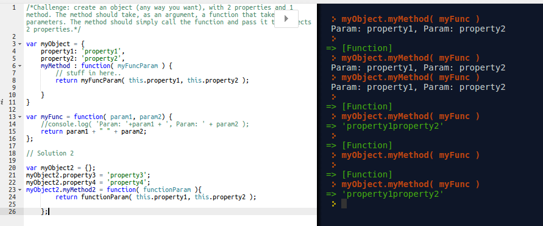

# Day 2

Create an object (any way you want), with 2 properties and 1 method. The method should take, as an argument, a function that takes 2 parameters. The method should simply call the function and pass it the objects 2 properties.

#Callbacks:

function that calls a function, and allows you to define functionality of later on. not saying what it has to do. "i don't want to tell you how to use these properties, but I'm telling you that you should use them".

Javascript doesn't know anything is a function when an object is created? it's mapping out what to do in the future, not saying what to do right now. 

